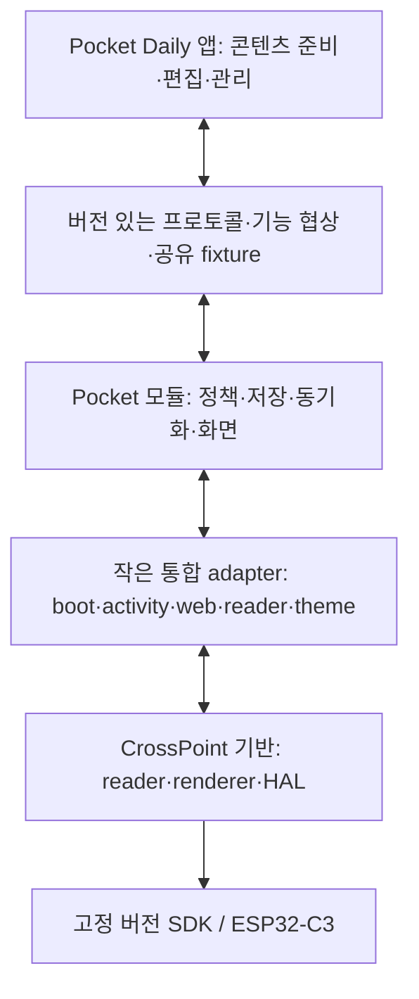

# Pocket Daily의 업스트림 수용성과 확장 구조 평가

조사일: 2026-09-29. 상태: 조사 결과와 권고안이며 구현 결정이나 하드웨어 승인 기록이 아니다.

**판정: 현재의 계층 분리 방향은 적절하다. 그러나 최신 CrossPoint를 낮은 위험으로
지속 수용할 수 있는 상태에는 아직 도달하지 않았다.** 제품 모듈 경계는 유지하고,
공통 기반의 누적 변경을 정리하는 통합 작업과 경계를 자동 검증하는 장치를 우선해야 한다.

## 조사 기준과 재현 가능한 관측

| 항목 | 조사 기준 / 결과 |
| --- | --- |
| 펌웨어 | `main`, `ccc601c5de1a8c5acad5076b6c78ec79687fa702` |
| 업스트림 | `sync-upstream.sh --check`로 fetch한 `upstream/master`, `93e98bb78702e29868a16a13b80c40e6b36ccdff`, 태그 `1.6.5` |
| 마지막 공통 조상 | `2754a5ff01644d36cf0a17db98f28408666ba518`, 2026-06-29; 당시 `platformio.ini`의 제품 버전은 `1.4.1` |
| Git 이력상 차이 | upstream-only 370 / fork-only 262 commits |
| 공통 조상 대비 포크의 `src/`, `lib/` 변경 | 텍스트 파일 경로 298개; 이 중 조상에 존재한 파일 134개 |
| 양쪽 모두 수정한 기존 `src/`, `lib/` 파일 | 125개 |
| 모의 병합 | 충돌 경로 112개; 그중 `src/`, `lib/` 94개 |
| 제품 전용 경로 충돌 | `src/pocket_daily/`, `src/activities/pocket_daily/` 0개 |
| 앱 소스 | sibling `pocket-daily`, 깨끗한 `main`, `2757e8051593696a07330c713040f44f9c128269` |
| 실행 검증 | 현재 펌웨어 소스의 host configure/build 성공, 527/527 tests 통과 |

커밋 차이는 미적용 기능 수가 아니다. 최근 30개 수정의 cherry-pick은 원래 SHA를
조상으로 만들지 않으므로 upstream-only 수에 계속 포함된다. 변경 파일 수에는
`src/`, `lib/` 아래 설정·번역 등의 텍스트도 포함된다. 충돌 경로 수는 Git 2.55.0의
`merge-tree`가 보고한 unmerged 경로 수이며, 수정 난이도나 결함 수가 아니다.
이전 [프로젝트 기록](PROJECT_MEMORY.md)의 106개와 이번 112개는 다른 조사 시점/방법의
관측이므로 증감의 원인을 확정하지 않는다.

재현 명령:

```sh
./scripts/sync-upstream.sh --check
git merge-base HEAD upstream/master
git rev-list --left-right --count upstream/master...HEAD
git diff --numstat 2754a5ff HEAD -- src lib
git diff --name-only 2754a5ff upstream/master -- src lib
git merge-tree --write-tree --name-only HEAD upstream/master
cmake -S test -B build/host-tests -DCMAKE_BUILD_TYPE=Release
cmake --build build/host-tests -j 4
ctest --test-dir build/host-tests --output-on-failure -j 4
```

모의 병합은 Git 객체만 생성하며 checkout/index/branch를 변경하지 않았다. 실제 병합은
하지 않았다. 시작부터 있던 SDK 변경은 `scripts/storage_sdk.patch`에 해당하며,
`platformio.ini`가 실행하는 `patch_storage_sdk.py`가 적용하는 관리된 변경이었다.
이를 임의의 미보관 SDK 수정이나 재현성 결함으로 판단하지 않는다.

## 유지할 강점

| 현재 구조 | 근거 | 평가 |
| --- | --- | --- |
| 제품 코드와 상속 코드의 분리 | [SEAM](SEAM.md), [Host](../src/pocket_daily/web/Host.h), [RouteDeps](../src/pocket_daily/web/PocketEndpoints.h) | 함수 포인터와 context로 기존 서버에 연결한다. 연결 자체에 동적 할당이 필요하지 않고, 제품 전용 파일의 텍스트 충돌을 피한다. |
| 기능별 호환성 협상 | [PocketStatus](../src/pocket_daily/web/PocketStatus.cpp), 앱 `Sources/CrossPointClient.swift:5`, `Sources/PocketModel.swift:329,393` | 추가 필드가 optional이며 `readingProgress == 1` 같은 기능 조건을 검사한다. 앱과 펌웨어를 항상 함께 배포하지 않아도 되는 기반이다. |
| 모드별 자원 제한 | [Profile](../src/pocket_daily/web/Profile.h), [PrivateApPolicy](../src/pocket_daily/web/PrivateApPolicy.cpp), [TransferAdmission](../src/pocket_daily/web/TransferAdmission.h) | 동기화 중 불필요한 브라우저/WS 서비스를 제한하고 free heap과 최대 연속 블록을 모두 검사한다. C3에서 기능 확장에 필요한 실제 자원 경계다. |
| 저장과 설치의 분리 | [ContentActiveStore](../src/pocket_daily/ContentActiveStore.cpp), [staged firmware](../src/pocket_daily/staged_firmware.cpp), [Nearby Sync](nearby-sync-v1.md) | 세대별 저장/검증과 사용자 설치 확인을 갖춘다. 앱 전송 완료를 곧바로 설치 성공으로 취급하지 않는다. |
| 캐시와 프로토콜의 명시적 버전 | [EPUB 규칙](../lib/Epub/AGENTS.md), [Section](../lib/Epub/Epub/Section.cpp), [reading progress](reading-progress-v1.md) | fork 캐시 v133과 partial format tag가 레이아웃 차이를 구별한다. 업스트림 캐시 번호를 그대로 채택하는 위험을 줄인다. |
| 실제 구현을 사용하는 테스트 | [reading progress CMake](../test/reading_progress/CMakeLists.txt), [gfx host](../test/gfx_host/CMakeLists.txt), [경계 테스트 등록](../test/live_studio/CMakeLists.txt) | 실제 파서/렌더러 및 앱 XPointer fixture를 검증한다. 문자열 경계 테스트와 순수 정책 테스트도 이미 있다. |
| 앱 미리보기의 소스 추적 | 앱 `docs/LIVE_STUDIO_DESIGN.md:215`, `scripts/host_renderer_artifact.py`; [host 계약](live-studio-v1.md) | XCFramework의 commit/source/artifact hash와 ABI를 관리한다. 펌웨어와 앱이 각자 렌더러를 재구현하는 것보다 의미 차이를 통제하기 쉽다. |

`lib/Epub`, `lib/EpdFont`, `lib/GfxRenderer`, `lib/hal`, `lib/KOReaderSync`의 include 조사에서는
제품 `src/pocket_daily`를 직접 include하는 역방향 의존을 찾지 못했다. 라이브러리의
제품 독립성은 상당 부분 유지되어 있다. 다만 라이브러리 구현 자체를 수정한 비용은 남는다.

## 주요 위험과 권고

### 1. 높음 — 기반 코드의 변경 누적이 업스트림 수용 비용을 지배한다

제품 디렉터리에는 충돌이 없는데 전체 병합은 112개 경로에서 충돌한다. 특히
`lib/Epub` 13개, `lib/EpdFont` 11개, `lib/GfxRenderer` 4개, `lib/hal` 6개,
`src/activities` 26개가 포함된다. 폴더 분리만으로 최신 기반을 쉽게 받아들일 수 있다는
가정은 현재 자료와 맞지 않는다.

공통 조상 대비 대표적인 포크 변경량은 다음과 같다. 수치는 추가/삭제 행이며
제품 기능만의 크기나 결함 수를 뜻하지 않는다.

| 파일 | 추가 / 삭제 |
| --- | --- |
| `src/activities/reader/EpubReaderActivity.cpp` | 812 / 271 |
| `lib/EpdFont/SdCardFont.cpp` | 706 / 229 |
| `lib/Epub/Epub/Section.cpp` | 738 / 124 |
| `lib/KOReaderSync/ChapterXPathResolver.cpp` | 742 / 36 |
| `src/activities/network/CrossPointWebServerActivity.cpp` | 690 / 83 |
| `src/network/CrossPointWebServer.cpp` | 554 / 147 |

**권고:** 별도 통합 작업에서 각 변경을 제품 전용 / 범용 수정 / 업스트림으로 대체 가능 /
폐기 가능으로 분류하고, reader·cache, font·renderer, HAL·SDK, network·lifecycle 단위로
양쪽 동작을 조정한다. 범용 수정은 제품 기능과 커밋을 분리하고 업스트림 기여 후보로
관리한다. cherry-pick은 시급한 수정을 위한 보완 수단으로 유지하되, 정기적인 전체
병합을 대신하는 영구 정책으로 사용하지 않는다.

최근 30개 이식은 유익하지만 **전체 1.6.5 기반 전환이 완료된 것은 아니다**.
제품 버전과 기반 업스트림 버전을 별도로 기록해야 한다.

### 2. 높음 — SDK와 런타임 변화는 모듈 분리 바깥의 위험이다

현재 [.gitmodules](../.gitmodules)는 `community-sdk`의 `open-x4-sdk`를,
업스트림의 [고정 커밋 .gitmodules](https://github.com/crosspoint-reader/crosspoint-reader/blob/93e98bb78702e29868a16a13b80c40e6b36ccdff/.gitmodules)는
`Free-Ink/freeink-sdk`를 사용한다. 업스트림 `HalDisplay.h`는 `freeink::Grayscale*`,
`SdCardFont.cpp`는 `freeink::font::*`를 사용한다. 이름만 바꾸는 이식이 아니다.
한편 pioarduino 플랫폼 URL은 양쪽 모두 `55.03.311`이므로 모든 툴체인이 뒤처졌다는
판정도 정확하지 않다.

[ServerTimeWait.cpp:4](../src/pocket_daily/web/ServerTimeWait.cpp)는 lwIP private header와
`tcp_tw_pcbs`를 직접 사용한다. host 구현은 0을 반환하므로 관련 정책 테스트가 통과해도
실제 TCP 내부 동작의 호환성을 증명하지 않는다.
[WifiInitBudget.cpp](../src/pocket_daily/web/WifiInitBudget.cpp)는 실험 환경으로 제한되어
있어 변경 격리가 더 명확하다.

**권고:** SDK와 네트워크 내부 API 접점은 명시적으로 등록하고, 버전 갱신마다 target
compile 및 실제 기기 전송/연결 종료/재연결을 검증한다. 현재 storage patch의
check-before-apply와 실패 시 중단 방식은 유지한다. FreeInk 이식 때는 HAL API 매핑과
패치 필요성을 다시 검토하고, 디스플레이·SD·sleep 동작을 독립적으로 확인한다.

### 3. 중상 — 설계된 경계가 점차 느슨해지고 있다

[SEAM의 include 규칙](SEAM.md)은 `web/*`, `boot/*`에서 허용하는 상속 헤더를
제한하고 `activities/*`를 금지한다. 실제로는
[PocketEndpoints.cpp:22](../src/pocket_daily/web/PocketEndpoints.cpp)에
`RecentBooksStore.h`, `activities/RenderLock.h`가 들어오며,
[UI-pack 적용:1298](../src/pocket_daily/web/PocketEndpoints.cpp)은 잠금과 전역 theme 변경을
직접 수행한다. `ProductBoot.cpp`의 `SilentRestart.h`도 문서의 허용 목록과 맞지 않는다.
이것만으로 런타임 결함이라고 할 수는 없지만, 문서상의 경계를 신뢰하기는 어렵다.

HTTP endpoint 파일은 현재 1,688행이며 읽기 위치, 파일 관리, 설정, 패키지, 설치 등을
함께 담당한다. 파일 크기만으로 분할할 이유는 없으나, 상속 구현에 대한 직접 의존이
늘어나는 지점은 관리해야 한다.

**권고:** reader state/최근 책 조회, 잠금이 필요한 theme 적용처럼 실제 변경 책임이
다른 연산만 기존 `RouteHost`/presentation host와 같은 작은 adapter로 넘긴다.
이름만 바꾸는 wrapper나 범용 서비스 컨테이너는 추가하지 않는다. 의도적인 예외는
사유와 함께 등록하고, 허용 include/금지 방향/새 상속 파일 수정 여부를 CI로 검증한다.
현재 `SyncRouteBoundaries`, `ThemeMetricBindings`는 좋은 출발점이지만 전체 include
규칙을 강제하지는 않는다.

### 4. 중상 — 단위 테스트와 제품 호환성 승인 사이에 빈틈이 있다

[일반 CI:148](../.github/workflows/ci.yml)는 기본 `pio run`, cppcheck, 형식 검사,
host tests를 수행한다. production 빌드는 별도 release workflow에서 실행되며 일반 PR
검증 행렬에는 없다. `SEAM.md`는 업스트림 병합 때 default/gh_release 둘 다 요구한다.
앱 측 테스트와 renderer artifact 검증 또한 펌웨어 PR의 이 CI에서 실행되지는 않는다.

호스트 테스트는 강점이다. 그러나 소스 문자열 검사, stub, 순수 정책 검증만으로
실제 `WebServer` route 등록, 조건부 컴파일, BLE→Wi-Fi 전환과 lwIP 동작까지 보장되지는 않는다.

**권고:** 업스트림/SDK 통합 PR에는 최소 default와 gh_release를 모두 build하고,
선택한 앱 commit과 공유 fixture로 계약 검증을 연결한다. 기존 golden fixture를 확장해
구 앱+신 펌웨어, 신 앱+구 펌웨어, 필드 누락/알 수 없는 필드, 기능 미지원 응답을 검증한다.
기능을 광고하는 status와 route의 가용성도 프로파일별로 비교한다.
SDK 내부 동작과 실제 HTTP 테스트는 별도 기기 검증으로 남긴다.

### 5. 중상 — 기능 확대의 한계는 메모리 수명에 달려 있다

[PrivateApPolicy.cpp:24](../src/pocket_daily/web/PrivateApPolicy.cpp)는 BLE 시작 전
64 KiB free / 32 KiB block, 시작 후 20/8 KiB, 경량 웹 시작 18/8 KiB 등의 gate를 둔다.
[네트워크 Activity:254](../src/activities/network/CrossPointWebServerActivity.cpp)는 radio
시작 전에 SD 폰트를 해제한다. 폴더 분리보다 이런 수명 제어가 기기 안정성에 직접적이다.

**권고:** 새 기능마다 상주/일시 자원, 획득/해제 시점, 동시 활성 모드를 명시한다.
기존의 모드별 서비스 제한과 필요 시 재시작 경계를 유지하며, 해제 검증 없이 상시 BLE,
네트워크, 미리보기 기능을 겹쳐 켜지 않는다. 콘텐츠 수집·변환·편집 등은 앱에 두고
기기는 bounded validation/storage/rendering에 집중한다. 레이어 재배치만으로 RAM이
줄어든다고 주장해서는 안 된다.

평가 기준도 reading idle, pairing, transfer, presentation으로 구분해야 한다.
AGENTS의 일반적인 50 KB 목표와 더 낮은 네트워크 gate를 한 숫자로 혼동하지 말고,
현재 [release checklist](release-checklist.md)의 모드별 조건과 실측을 함께 사용한다.

### 6. 중간 — 운영 문서의 불일치가 잘못된 병합을 유도할 수 있다

[SEAM.md:320](SEAM.md)는 `upstream/main` 직접 병합을 안내하지만 실제 운영 기준과
[동기화 스크립트](../scripts/sync-upstream.sh)는 `upstream/master` 및 wrapper 사용이다.
[product-architecture.md](product-architecture.md)는 AgentDeck 제거를 알린 뒤에도
현재 provider, 삭제된 디렉터리, legacy discovery 설명을 함께 담고 있다.
[모드 수명 문서](mode-lifecycle-resources.md)는 design-only이며 현재 정책과 다른 과거
radio recovery 설계도 포함한다.

현재 wrapper는 `LOCAL_BRANCH=main`으로 고정되어 `git merge --no-edit`를 실행한다.
큰 기반 통합을 검증용 branch에서 수행하려면 wrapper가 대상 branch를 명시적으로
받는 경로부터 마련해야 한다. 현재 스크립트를 그대로 실행하면 별도 통합 branch에
머물러 시험할 수 있다고 가정해서는 안 된다.

**권고:** 실제 소스 기준의 현재 아키텍처, 역사적 설명, 미구현 제안을 구분한다.
동기화 절차는 wrapper와 단일 대상 branch를 가리키게 하고, 중복된 승인 조건을 하나의
체크리스트로 연결한다. 문서 수정만으로 위험이 해결되지는 않지만, 잘못된 작업의 시작을
막을 수 있다.

## 권장하는 목표 구조와 선택



이것은 새 런타임 프레임워크 제안이 아니다. 현 구조에 이미 있는 함수 포인터/값 snapshot
경계를 완성하고 유지하는 방향이다. upstream-owned 쪽에는 명시적 호출 지점을 남기고,
제품 정책을 그 자리에서 계속 확장하지 않는다. 업스트림 범용 개선은 core 안에 남되,
제품 패치와 구분해 관리한다.

| 선택지 | 평가 |
| --- | --- |
| 현재 fork + 작은 adapter + 범용 패치 관리 | **권장.** 기존 검증과 구현을 활용하며 실제 충돌 지점을 줄일 수 있다. |
| cherry-pick만 계속 사용 | 단기 대응에는 유용하나, 기반 API 변경과 선행 의존 누적을 해결하지 못한다. |
| CrossPoint 전체를 바로 submodule/불변 vendor로 전환 | 상속 파일을 수정해야 하는 현 구조에서는 패치 적용 위치만 바뀐다. upstream이 안정된 확장 API를 제공할 때 재검토한다. |
| 동적 plugin/범용 event bus 도입 | 현재 자료로 필요성이 입증되지 않았다. 수명·메모리·디버깅 부담을 먼저 정량화해야 한다. |
| reader core 재작성 | 검증 비용이 크고 업스트림 개선을 활용한다는 목적과 멀어진다. |

## 실행 우선순위와 완료 조건

| 순서 | 작업 | 완료 조건 |
| --- | --- | --- |
| 1 | 기준 고정과 회귀 보호 | upstream SHA, 제품 SHA, SDK/patch, 앱 계약/renderer provenance를 한 통합 기록에 고정. 현재 fixture와 제품 동작 목록 확보. |
| 2 | 경계/CI 보강 | 허용 의존 검사, carried-patch 등록 검사, default+production 빌드, 양쪽 계약 fixture 검증. 문서와 실제 예외 일치. |
| 3 | 1.6.5 기반 통합 | 별도 통합 branch에서 영역별 의미 조정. 기존 product main을 rebase하지 않고 merge 이력 보존. 시험 빌드와 캐시 재생성/복구 검증 후 수용. |
| 4 | 지속적 유지 | 안정 릴리스마다 dry merge와 의미 검토. 겹치는 수정, 충돌 경로, carry patch 수명, 버전별 자원 실측을 추적. 일반 수정 upstream 기여는 별도 승인/절차로 진행. |

통합의 성공 기준은 충돌 마커 제거가 아니다. 독서 위치/한글/폰트/cache, 앱 전송 및
기능 협상, Home 진입과 복귀, SD와 업데이트 복구가 유지되어야 한다. upstream에 새
기능이 생겼다는 이유만으로 모두 활성화하지 말고 X3/X4 읽기 경험과 자원 예산으로 선택한다.

## 검증 범위와 한계

이번 조사는 저장소/앱 소스, 최신 fetch한 stable 이력, 모의 병합 및 현재 host suite에
근거한다. host build에는 기존 unused variable/parameter/function 경고 7건이 출력되었다.
527개 테스트 통과를 무경고 firmware build나 병합 결과의 테스트 통과로 표현하지 않는다.

default/gh_release firmware build, strict cppcheck, 앱 Xcode tests/build는 이번 조사에서
재실행하지 않았다. 펌웨어/앱/빌드 코드는 변경하지 않았다. X3/X4의 네 방향 표시,
free heap/최대 블록/누수, BLE·Wi-Fi 전환, HTTP/SD/OTA/recovery/watchdog, EPUB 캐시
재파싱 및 기존 partial cache 거부는 이번에 물리적으로 검증하지 않았다.
향후 통합 기기 검증은 File Transfer → Join a Network와 `scripts/pocket_put.py`를
사용하고, 사용자 설치 및 결과 확인을 release checklist에 기록해야 한다.
